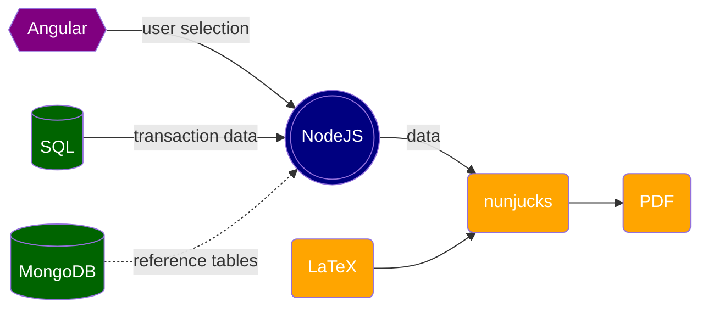

# Overview of LaTeX-nunjucks stack

LaTeX-nunjucks is a stack for building dynamic PDF documents. We use LaTeX because it produces professinal-looking documents and offers rich features; in particular, its handling of intra-document references significantly reduces maintenance cost.

Chart below shows how different technologies work together:

___
Below is a rundown of the steps:
1. A user selects a line of business (e.g. Commercial Ouput Policies) and a data entry (e.g. an insurance policy) on the front end with possible customization (e.g. what documents to print).
2. User selection is sent to the back end.
3. Based on user selection, queries are executed agaist a SQL database to retrieve transaction data (e.g. policy information).
4. For some apps, queries are executed against a MongoDB database to retrieve reference tables that are used for data transformation.
5. Data from databases are processed and transformed before they are injected into LaTeX templates via nunjucks templating tool.
6. Multiple LaTeX templates are assembled and compiled to produce PDF documents.