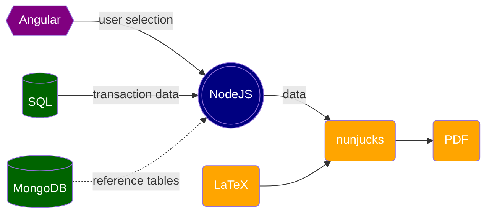

# An overview of LaTeX-nunjucks stack

LaTeX-nunjucks is a stack for building dynamic PDF documents proposed by [Lindsey Fletcher](mailto:lindsey.fletcher23@gmail.com). LaTeX produces professinal-looking documents and offers rich features; in particular, its handling of intra-document references significantly reduces maintenance cost.

## 1. A brief history

Prior to adopting the LaTeX-nunjucks stack, we employed a front end solution (Angular), which works wonders for the COP (Commercial Output Policies Rater) tool but caused a huge pain during the development of the Lobster Boat Rater (due to remote desktop setup and user errors).

We later briefly piloted a browser-based back end solution (Chromium + PUG template engine). Though everything works without issues, this solution does not handle intra-document references, which is of vital importance to legal documents such as contracts.

The LaTeX-nunjucks stack was proposed by Lindsey Fletcher while working on the back end solution. LaTeX offers a rich collection of templates, produces professional-looking documents, and handles intra-document references natively. It is currently our best solution to building PDF documents.

## 2. App structure

## 3. Workflow

1. A user selects a line of business (e.g. Commercial Ouput Policies) and a data entry (e.g. an insurance policy) on the front end with possible customization (e.g. what documents to print).
2. User selection is sent to the back end (via a POST call or GET call with URL parameters).
3. Based on user selection, queries are executed agaist a SQL database to retrieve transaction data (e.g. policy information).
4. For some apps, queries are executed against a MongoDB database to retrieve reference tables that are used for calculation/data transformation.
5. Data from databases are processed and transformed before they are injected into LaTeX templates via nunjucks templating tool.
6. Multiple LaTeX templates are assembled and compiled to produce PDF documents.

